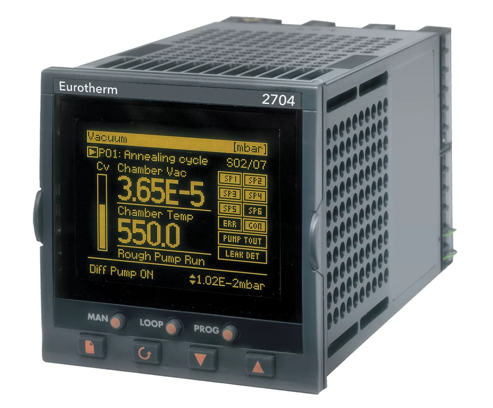
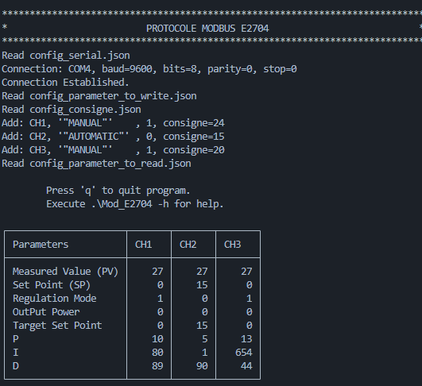

# What is the project ?

The purpose of that project is to create a program for control an Erotherm 2704 regulator.



# Use

Execute : `.\Mod_E2704.exe`

## Result



# Subject

*This is a traduction of the original subject*

The E2704 is a **PID temperature regulator** (Eurotherm brand). It has three regulatory pathways.

As the name suggests, the temperature regulator is an instrument used to control temperature. It makes it possible to maintain, on each of its regulation channels, the temperature in relation to a setpoint requested by the user.

For this, it has:

* **Sensor inputs**: connected to a sensor or a temperature probe, this input provides the measured temperature,
* **Logic or analog outputs** (ex: relay output): they are connected to the heating elements.

The E2704 provides **proportional integral and derivative**, or PID, control.

To carry out its regulation, the 2704 regulator compares the actual temperature measurement (sensor input) with what is called the setpoint (temperature requested by the user).

Then, three parameters come into play to adjust the difference between the measurement and the setpoint: 
* P (Proportional), 
* I (Integral), 
* D (Derivative).

---

The regulator can operate in two regulation modes:
* **Automatic mode**: In this mode, the output power is automatically controlled by the regulator to maintain the measured temperature value at the desired setpoint.  
The controller operates normally in this mode from a temperature set point indicated by the operator,

* **Manual Mode**: In this mode, the output power is adjusted manually by the operator.  
The operator therefore indicates a power setpoint directly and not a temperature setpoint.

> The operator can thus indicate a temperature setpoint or a power setpoint, depending on the mode in which the regulator is configured.

## Parameterization of the E2704 regulator

* Communication by: **RS232** serial link
* Communication protocol used: **Modbus**

## Specifications

* Slave number: 1,
* Resolution: without decimal => all values are coded on 16 bits,
* Address offset: 1024 for control channels 2 and 3,

Example: measured temperature address (MV = Measured Value):

|Channel|modbus address|final|
|:-----:|:-------------|:----|
|1      |1             |1    |
|2      |1 + 1024      |1025 |
|3      |1 + (2*1024)  |2049 |

## Addressing table

|Data              |Modbus address|Data type|
| :--------------- | :----------- | :-----: |
| Measured Value   | 1            | Short   |
| Set Point        | 5            | Short   |
| Target Set Point | 2            | Short   |
| Regulation mode  | 273          | Short   |
| Output Power     | 3            | Short   |
| P                | 251          | Short   |
| I                | 252          | Short   |
| D                | 253          | Short   |

## Work to be done

Read, on each of the three control channels, the following values:
1. Temperature measured by sensor input = Measured Value (PV),
2. Set point taken into account by the regulator = Set Point (SP),
3. Regulation mode (0: Automatic / 1: Manual),
4. Output Power,
5. Proportional regulation parameter = P,
6. Integral regulation parameter = I,
7. Derivative regulation parameter = D .

Send the following commands to the temperature controller:
1. Temperature setpoint = Target Set Point,
2. Power setpoint = Output Power,
3. Regulation mode.

# Simulation

## Modbus

Start the MODBUS emulator program: `mod_RSsim.exe`

Setup on comunication serial > connect COM1:

* 9600  
* 8 bits
* no parity
* 1 bit stop


## Virtual serial port

For communicate on the same machine between the program and the modbus emulator program,

We need to create a virtual port.

Open `HHD Virtual Serial Port Tools`

* Create local bridge
* Select: COM1 and COM2


## Communication debug

### Example of manual setup: 

```
****************************************************************************
*                             PROTOCOLE MODBUS                             *
****************************************************************************
Saisir le type de communication: 0 (liaison Serie) / 1 (liaison IP)  ? 0
Entrer le numero de port?
2
*********** Parametrage du port serie ***********
Entrer la vitesse de transmission?
9600
Entrer le nombre de bits de donnees? (5-8)
8
Entrer la parite? 0 (pas de parite) / 1 (Parite impair) / 2 (Partie pair)
0
Entrer le nombre de bist de stop? 0 (1 bit) / 1 (1.5 bits) / 2 (2 bits)
0

****************************************************************************
   1. Demande de lecture.
   2. Demande d'ecriture.
   3. Quitter.
Que souhaitez-vous faire?
```

### Reading example:

```
****************************************************************************
   1. Demande de lecture.
   2. Demande d'ecriture.
   3. Quitter.
Que souhaitez-vous faire?
1

 DEMANDE DE LECTURE
A partir de quelle adresse souhaitez-vous lire?
0
Quel type de parametre voulez-vous lire? 0 (short) / 1 (int) / 2 (float)
0

 Send trame (length = 8):01 03 00 00 00 01 84 0A

 Receive trame (length = 7): 01 03 02 00 09 78 42
  Value : 9

****************************************************************************
```

### Writing example:

```
Entre la valeur a ecrire?
8

 Send trame (length = 8):01 06 00 01 00 08 D9 CC

 Receive trame (length = 8): 01 06 00 01 00 08 D9 CC
  Value[0] : 8
```